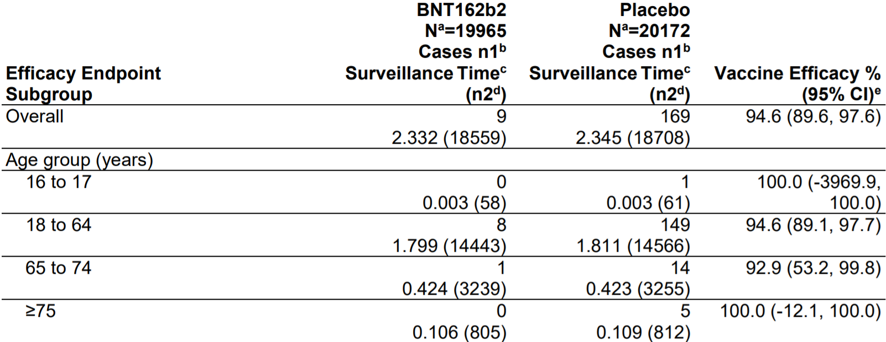

# Study Problem 2

CDC defines [vaccine efficacy](www.cdc.gov/csels/dsepd/ss1978/lesson3/section6.html) as below:

$$ \textrm{Vaccine efficacy} = \frac{\textrm{Risk among unvaccinated group}-\textrm{Risk among vaccinated group}}{\textrm{Risk among unvaccinated group}} $$

According to the [FDA Briefing Document](www.fda.gov/media/144245/download), the Pfizer-BioNTech COVID-19 Vaccine was 94.6% effective among the age group between 18 and 64. The following table from the document presents detailed results.



Based on the Law of Large Numbers and the Central Limit Theorem, the sample mean is normally distributed around the population mean. The risk of COVID-19 amoung the treatment and control group follows the Bernoulli distribution, so we can replicate the result as follows:


```{r}
# Generate variables for the treatment and control group between the age of 18 and 64, based on the table.

NV =  14443
NU =  14566
RV = 8/NV
RU = 149/NU
VE = (RU - RV)/RU

print( paste( "VE for the age group 18 to 64 is", round(VE, 4) ) )

# Calulate the variance of risk estimates using the Bernoulli distribution.

Var.RV = RV*(1-RV)/NV
Var.RU = RU*(1-RU)/NU

# Set up Monte Carlo draws using the normal distribution to simulate repeated experients.

set.seed(14)

B = 10000
    RVs = RV  + rnorm(B)*sqrt(Var.RV)
    RUs = RU  + rnorm(B)*sqrt(Var.RU)
    VEs= (RUs - RVs)/RUs

# Calculate the 95% conference interval of vaccine efficacy from Monte Carlos draws.

CI.VE1 = quantile( VEs, c(.025, .975) )

print( paste("95% confidence interval is [", round(CI.VE1[1], 4), ",", round(CI.VE1[2], 4), "]") )
```

The 95% confidence interval from our simulation is close to the results in the table, but the numbers do not exactly match. It is because FDA used the exact inversion of binomial tests, or the Cornfield procedure While we relied the Bernoulli and normal distribution to replicate the results for age group 18 to 64 in the the table. If we apply the Cornfield procedure as below, the 95% confidence interval becomes identical to the results in the table.

```{r}
# Calculate the 95% conference interval of vaccine efficacy through the Cornfield procedure.

library(ORCI)

CI.VE2 <- 1 - Cornfieldexact.CI(8, NV, 149, NU, conf = 0.95, interval = c(1e-08, 1e+08))
print( paste("95% confidence interval based on the Corfield procedure is [", round(CI.VE2[2], 4), ",", round(CI.VE2[1], 4), "]") )
```


# Study Problem 3

The re-employment bonus RCT notebook demonstrates how esimates and standard errors vary by applying the following regression approaches:

* classical 2-sample approach, no adjustment (CL)
* classical linear regression adjustment (CRA)
* interactive regression adjustment (IRA)
* interactive regression adjustment with double lasso (partialling out by lasso) (IRA-DL)

However, the notebook did not include all possible control variables as it ommitted *hispanic*, *q1*, *recall*, *nondurable* and *muld*. Adding *q1* leads to exact multicollinearity in relation to five dummy variables from *q2* to *q6*, so we can instead use the other three variables and their interactions as additional controls to make the model even more flexible. 

```{r}
# Load the data of the treatment group 4 and control group from the experiment.

penn <- read.table("penn_jae.dat", header = TRUE)
penn <- subset(penn, tg == 0 | tg == 4)
t4 <- (penn$tg == 4)

# Generate a model using the classical 2-sample approach without adjustment (CL)

library(lmtest)
library(sandwich)

ols.cl <- lm(data = penn, formula = log(inuidur1) ~ t4)
ols.cl <- coeftest(ols.cl, vcov. = vcovHC(ols.cl, type = "HC1"))

# Generate two models using the classical linear regression adjustment (CRA) with fewer and more controls

ols.cra1 <- lm( data = penn, formula = log(inuidur1) ~ t4 + (female + black + othrace + factor(dep) + q2 + q3 + q4 + q5 + q6 + agelt35 + agegt54 + durable + lusd + husd)^2 )
ols.cra1 <- coeftest(ols.cra1, vcov. = vcovHC(ols.cra1, type = "HC1"))

ols.cra2 <- lm( data = penn, formula = log(inuidur1) ~ t4 + (female + black + hispanic + othrace + factor(dep) + q2 + q3 + q4 + q5 + q6 + recall + agelt35 + agegt54 + durable + nondurable + lusd + husd + muld)^2 )
ols.cra2 <- coeftest(ols.cra2, vcov. = vcovHC(ols.cra2, type = "HC1"))

# Generate two models using the interactive regression adjustment (IRA) with fewer and more controls

X1 <- model.matrix(data = penn, object = ~ (female + black + othrace + factor(dep) + q2 + q3 + q4 + q5 + q6 + agelt35 + agegt54 + durable + lusd + husd)^2 )
demean <- function(x){x - mean(x)}
X1 <- apply(X1, 2, demean)[, -1]
ols.ira1 <- lm(data = penn, log(inuidur1) ~ t4*X1)
ols.ira1 <- coeftest(ols.ira1, vcov. = vcovHC(ols.ira1, type = "HC1"))

X2 <- model.matrix(data = penn, object = ~ (female + black + hispanic + othrace + factor(dep) + q2 + q3 + q4 + q5 + q6 + recall + agelt35 + agegt54 + durable + nondurable + lusd + husd + muld)^2 )
demean <- function(x){x - mean(x)}
X2 <- apply(X2, 2, demean)[, -1]
ols.ira2 <- lm(data = penn, log(inuidur1) ~ t4*X2)
ols.ira2 <- coeftest(ols.ira2, vcov. = vcovHC(ols.ira2, type = "HC1"))

# Generate two models using the interactive regression adjustment with double lasso (partialling out by lasso) (IRA-DL) with fewer and more controls

library(hdm)

t4 <- demean(t4)
DX1 <- model.matrix(~ t4*X1)[, -1]
rlasso.ira1 <- summary(rlassoEffects(DX1, log(penn$inuidur1), index = 1))

DX2 <- model.matrix(~ t4*X2)[, -1]
rlasso.ira2 <- summary(rlassoEffects(DX2, log(penn$inuidur1), index = 1))

# Create a table that compares estimates and standard errors by adjustment approach and the number of controls

table <- matrix(0, 4, 4)
table[1,1] <- ols.cl[2,1]
table[1,2] <- ols.cra1[2,1]
table[1,3] <- ols.ira1[2,1]
table[1,4] <- rlasso.ira1[[1]][1]
table[2,1] <- NA
table[2,2] <- ols.cra2[2,1]
table[2,3] <- ols.ira2[2,1]
table[2,4] <- rlasso.ira2[[1]][1]
table[3,1] <- ols.cl[2,2]
table[3,2] <- ols.cra1[2,2]
table[3,3] <- ols.ira1[2,2]
table[3,4] <- rlasso.ira1[[1]][2]
table[4,1] <- NA
table[4,2] <- ols.cra2[2,2]
table[4,3] <- ols.ira2[2,2]
table[4,4] <- rlasso.ira2[[1]][2]
colnames(table) <- c("CL", "CRA", "IRA", "IRA-DL")
rownames(table) <- c("estimate", "estimate w all controls", "standard error", "standard error w all controls")
table

```

The table above shows that adding more controls and their interactions increased the size of estimates and lowered standard errors to a slight extent for the three aproaches using controls. However, the new numbers do not differ much from original results in the notebook, so adding more controls do not lead to noticeable gains in efficiency.

# Study Problem 6

SUTVA can be violated mainly in two ways such as inconsistent treatment and spill-over effect. If treatment is poorly defined or not delivered in an identical manner, we cannot assume that the unit treatment value is the same for those who were treated. In addition, the unit treatment value becomes unstable When treatment spills over and affect not only the treatment group but also the control group.

Let's imagine an RCT which broadcasts radio messages against domestic violence to randomly chosen villages to identify the effect of such broadcasts on reducing the incidents of domestic violence. Concerning consistent treatment, SUTVA should hold, for example, when the content of radio messages are identical and households in treated villages can actually receive radio transmission. If contents are different or some households are out of reach, SUTVA might be violated because treatment villages receive different or a varying degree of treatments. Concerning spill-over effect, SUTVA may not hold, for example, when villages in the control group can also receive radio broadcasts or people from treated villages spread words to untreated villages. In such cases, the contents of radio messages can spill over to people in untreated villages and affect their behavior as if they are in treated villages. Ensuring a geographical buffer between treatment villages and control villages might prevent spill-over and maintain SUTVA.

# Study Problem 7

If we subject an individual to treatment and then to control, the individual concerned does not remain the same and surrounding conditions also do not stay identical because all circumstances change as time passes by. As the underlying status of the world is randomly determined at different time, the proposed approach of alternating assignment is not likely to lead to individual treatment effect.

Even with a time machine, sequentially alternating assignment by rewinding the clock might not generate the exact same underlying status of the world to calculate individual treatment effect. We usually make an observation of outcomes some time after assigning treatment or control, and during the period, the individual is likely to go through a randomly different series of the surrounding world which can affect outcomes. However, if we use a time machine repeatedly, we might be able to estimate individual treatment effect through law of large numbers by going back in time many times; randomly subjecting the individual to treatment and control; and calculate the average of observed treatment effects.