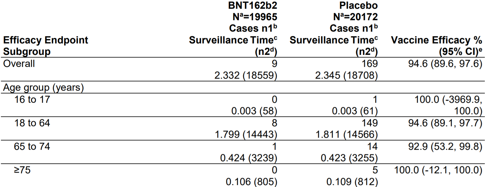

# Study Problem 2

CDC defines [vaccine efficacy](www.cdc.gov/csels/dsepd/ss1978/lesson3/section6.html) as below:

$$ \textrm{Vaccine efficacy} = \frac{\textrm{Risk among unvaccinated group}-\textrm{Risk among vaccinated group}}{\textrm{Risk among unvaccinated group}} $$

According to the [FDA Briefing Document](www.fda.gov/media/144245/download), the Pfizer-BioNTech COVID-19 Vaccine was 94.6% effective among the age group between 18 and 64. The following table from the document presents detailed results.



Based on the Law of Large Numbers and the Central Limit Theorem, the sample mean is normally distributed around the population mean. The risk of COVID-19 amoung the treatment and control group follows the Bernoulli distribution, so we can replicate the result as follows:


```{r}
# Generate variables for the treatment and control group between the age of 18 and 64, based on the table.

NV =  14443
NU =  14566
RV = 8/NV
RU = 149/NU
VE = (RU - RV)/RU

print( paste( "VE for the age group 18 to 64 is", VE ) )

# Calulate the variance of risk estimates using the Bernoulli distribution.

Var.RV = RV*(1-RV)/NV
Var.RU = RU*(1-RU)/NU

# Set up Monte Carlo draws using the normal distribution to simulate repeated experients.

set.seed(14)

B = 10000
    RVs = RV  + rnorm(B)*sqrt(Var.RV)
    RUs = RU  + rnorm(B)*sqrt(Var.RU)
    VEs= (RUs - RVs)/RUs

# Plot the distribution of vaccine efficacy estimates from Monte Carlos draws.
    
plot( density(VEs), col = "red", main = "Approximate Distribution of VE estimates" )

# Calculate the 95% conference interval of vaccine efficacy from Monte Carlos draws.

CI.VE =  quantile( VEs, c(.025, .975) )

print( paste("95% confidence interval is [", CI.VE[1], ",", CI.VE[2], "]"), digits = 4 )
```

While we used the Bernoulli and normal distribution to replicate the results for age group 18 to 64 in the the table, FDA used the exact inversion of binomial tests, or the Cornfield procedure. The 95% confidence interval from our simulation does not exactly match the results in the table, but it is very close.

# Study Problem 3


# Study Problem 6

# Study Problem 7
